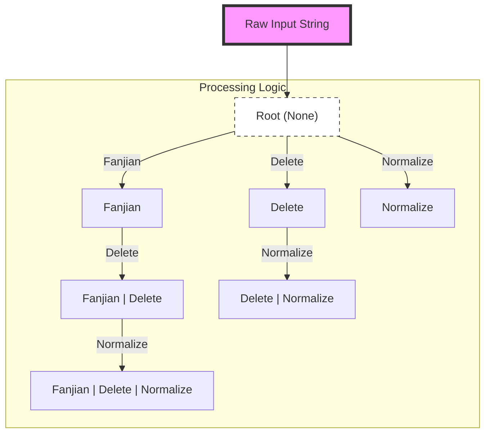
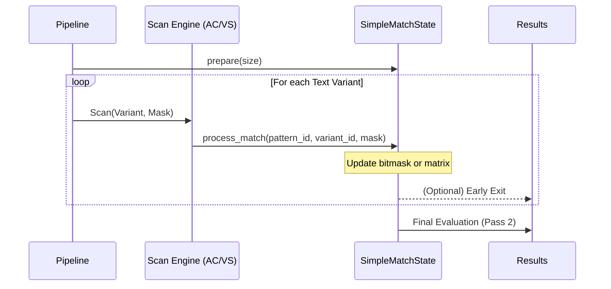

# Design

## Transformation

* `FANJIAN` (used in `Fanjian`): built from [Unihan_Variants.txt](./data/str_conv/Unihan_Variants.txt) and [EquivalentUnifiedIdeograph.txt](./data/str_conv/EquivalentUnifiedIdeograph.txt).
* `NUM-NORM` (used in `Normalize`): built from [DerivedNumericValues.txt](./data/str_conv/DerivedNumericValues.txt).
* `TEXT-DELETE` (used in `Delete`): built from [DerivedGeneralCategory.txt](./data/str_conv/DerivedGeneralCategory.txt) (contains symbols and punctuation characters for removal).
* `WHITE-SPACE` (used in `Delete`): a hardcoded list of Unicode whitespace characters.
* `PINYIN` and `PINYIN-CHAR` (used in `PinYin` and `PinYinChar`): built from [Unihan_Readings.txt](./data/str_conv/Unihan_Readings.txt).
* `NORM` (used in `Normalize`): built from [NormalizationTest.txt](./data/str_conv/NormalizationTest.txt) and [DerivedGeneralCategory.txt](./data/str_conv/DerivedGeneralCategory.txt) (contains alphanumeric and general symbol variations).

## SimpleMatcher

### Overview

The `SimpleMatcher` is the core component, designed to be fast, efficient, and easy to use. It handles large amounts of data and identifies words based on predefined types. It supports complex logical operations within a single pattern entry:
- **AND (`&`)**: All sub-patterns separated by `&` must match for the rule to trigger.
- **NOT (`~`)**: If any sub-pattern preceded by `~` matches, the rule is disqualified.

### Key Concepts

1. **WordID**: Represents a unique identifier for a word in the `SimpleMatcher`.

### Structure

The `SimpleMatcher` uses a mapping structure to define words and their IDs based on different match types. Below is an example configuration:

```json
{
    "1": {
        "1": "hello&world",
        "2": "你好"
        // other words
    }
    // other simple match type word maps
}
```

- `1` and `2`: These are `WordID`s used to identify words in the `SimpleMatcher`.

### Real-world Application

In real-world scenarios, `word_id` is used to uniquely identify a word in the database, allowing for easy updates to the word and its variants.

### Logical Operations

- **OR Logic (between different `process_type` and words in the same `process_type`)**: The `simple_matcher` is considered matched if any word in the map is matched.
- **AND Logic (between words separated by `&` within a `WordID`)**: All words separated by `&` must be matched for the word to be considered as matched.
- **NOT Logic (between words separated by `~` within a `WordID`)**: All words separated by `~` must not be matched for the word to be considered as matched.

### Usage Cases

#### Word1 AND Word2 match
```json
Input:
{
    "1": {
        "1": "word1&word2"
    }
}

Output: Check if `word_id` 1 is matched.
```

#### Word1 OR Word2 match
```json
Input:
{
    "1": {
        "1": "word1",
        "2": "word2"
    }
}

Output: Check if `word_id` 1 or 2 is matched.
```

#### Word1 NOT Word2 match
```json
Input:
{
    "1": {
        "1": "word1~word2"
    }
}

Output: Check if `word_id` 1 is matched.
```

## Architecture & Optimization

To achieve extremely high throughput and robust latency across thousands of simultaneous matching rules, `matcher_rs` incorporates several advanced architectural optimizations beneath its logical API.

### 1. Text Transformation Pipeline (DAG-based Reduction)

Real-world text matching often requires matching across multiple variations (Traditional/Simplified Chinese, symbol removal, Pinyin, etc.). Naively applying these transformations sequentially would lead to exponential work and redundant string allocations.

#### `ProcessType` Bitmask & Trie Optimization
`matcher_rs` uses an 8-bit `ProcessType` bitmask to represent combinations of transformations. At initialization, it constructs a Directed Acyclic Graph (DAG) in the form of a Trie via `build_process_type_tree`. Each node in this tree represents a unique transformation step (`Fanjian`, `Delete`, `Normalize`, `Pinyin`).



*   **Breadth-First Traversal**: The pipeline (`reduce_text_process_with_tree`) traverses this DAG. For each node, it applies its specific transformation to the output of its parent.
*   **Shared Prefixes**: If multiple rules require different transformation chains that share a prefix (e.g., `Fanjian | Delete` and `Fanjian | Normalize`), the `Fanjian` step is performed only once.
*   **Lazy Transformations (`Cow<'a, str>`)**: Transformations are lazy. If a step (like `Delete`) finds no characters to modify, it returns a borrowed `Cow::Borrowed`, avoiding new string allocations.
*   **Bitmask Aggregation**: Each generated text variant is tagged with a `u64` bitmask representing all `ProcessType` combinations that lead to that specific string variant. This allows a single scan of a variant to satisfy multiple rule configurations.

### 2. High-Performance Matching Engine (Two-Pass)

The matching process is divided into two distinct phases to decouple substring search from complex logical evaluation.

#### Pass 1: Pattern Scanning (Deduplicated)
All unique sub-patterns (segments separated by `&` or `~`) from all rules and all `ProcessType` variants are deduplicated and compiled into a single automaton:
*   **Aho-Corasick**: Uses `ContiguousNFA` or `DFA` for $O(N)$ scanning.
*   **Vectorscan (Hyperscan)**: Optional SIMD-accelerated engine for ultra-fast matching on supported architectures.
*   **Pattern Mapping**: The engine maintains `ac_dedup_entries` and `ac_dedup_ranges` to map a single hit in the automaton back to all affected rule segments and their respective `ProcessType` requirements.

#### Pass 2: Logical Evaluation
The system evaluates the hits to determine if any rules are fully satisfied.



### 3. State Management & Evaluation Optimizations

#### Generation-based State Re-use
`SimpleMatchState` avoids the $O(N)$ cost of clearing state between calls by using a **Generation ID**.
*   Each `WordState` tracks its own `matrix_generation` and `not_generation`.
*   Instead of zeroing vectors, the system increments a global `generation` counter. 
*   An entry is considered "empty" if its generation ID doesn't match the current one, providing a $O(1)$ "clear" operation.

#### Sparse-Set Optimization (`touched_indices`)
To avoid scanning thousands of rules in Pass 2, the engine maintains a `touched_indices` vector. Only rules that had at least one sub-pattern hit in Pass 1 are added to this list. Pass 2 then only evaluates these "touched" rules.

#### Bitmask Fast-Path
Rules with simple AND/NOT logic (where each part only needs to match once) are optimized via bitmasks:
*   **`expected_mask`**: A pre-calculated `u64` where each bit represents a required AND segment.
*   **`satisfied_mask`**: A `u64` updated during Pass 1.
*   **$O(1)$ Verification**: `satisfied_mask == expected_mask`.
*   **NOT Short-circuit**: If a NOT segment (`~`) is matched, `not_generation` is set to the current generation, immediately disqualifying the rule for the rest of the query.

#### Matrix-based Fallback
For complex requirements (e.g., > 64 logical segments or count-based AND logic like `a&a&b`), the system falls back to a flat `i32` matrix:
*   Rows represent logical segments, columns represent text variants.
*   State is tracked as `(count - matches)`. A segment is satisfied when its value $\le 0$ in any variant column.

### 4. Memory & Resource Efficiency

*   **String Pooling**: A thread-local `STRING_POOL` caches and reuses `String` allocations produced during transformations, mitigating pressure on the global allocator (`mimalloc`).
*   **Zero-Copy Logic**: Heavy use of `Cow<'a, str>` and zero-copy deserialization for static transformation rules ensures minimal memory overhead.
*   **Static Automata**: Core transformation rules (Fanjian, Pinyin) are pre-compiled into optimized byte-layouts at library compile-time using `daachorse` (Double-Array Aho-Corasick). At runtime, these are "loaded" via zero-copy pointer casts for **instant startup**.
*   **Thread-Local Storage (TLS)**: All mutable matching state is stored in `thread_local!` buffers. This makes the `SimpleMatcher` itself `Send + Sync`, allowing it to be shared across threads (e.g., via `Arc`) without any lock contention.

### 5. Compiled vs. Runtime Matchers

The library supports two modes for its transformation matchers:
1.  **Static (Default)**: Dictionaries are pre-compiled into the binary. Fast startup, fixed rules.
2.  **Runtime (`runtime_build` feature)**: Dictionaries are built at runtime. Allows for dynamic rule updates but has a higher startup cost.
