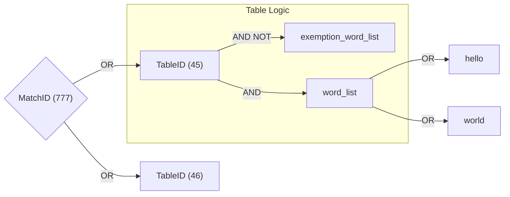

# Design

## Transformation

* `FANJIAN`: build from [Unihan_Variants.txt](./data/str_conv/Unihan_Variants.txt) and [EquivalentUnifiedIdeograph.txt](./data/str_conv/EquivalentUnifiedIdeograph.txt).
* `NUM-NORM`: build from [DerivedNumericValues.txt](./data/str_conv/DerivedNumericValues.txt).
* `TEXT-DELETE` and `SYMBOL-NORM`: build from [DerivedGeneralCategory.txt](./data/str_conv/DerivedGeneralCategory.txt).
* `WHITE-SPACE`: build from [PropList.txt](./data/str_conv/PropList.txt).
* `PINYIN` and `PINYIN-CHAR`: build from [Unihan_Readings.txt](./data/str_conv/Unihan_Readings.txt).
* `NORM`: build from [NormalizationTest.txt](./data/str_conv/NormalizationTest.txt).

## Matcher

### Overview

The `Matcher` is a powerful and complex system designed to identify sentence matches using multiple methods. Despite its complexity, it offers significant flexibility and power when used correctly. The main components of the `Matcher` are `MatchID` and `TableID`.

### Key Concepts

1. **MatchID**: Represents a unique identifier for a match.
2. **TableID**: Represents a unique identifier for a table within a match.

### Structure

The `Matcher` utilizes a JSON structure to define matches and tables. Below is an example of its configuration:

```json
{
    "777": [
        {
            "table_id": 45,
            "match_table_type": {"process_type": "MatchNone"},
            "word_list": ["hello", "world"],
            "exemption_process_type": "MatchNone",
            "exemption_word_list": []
        }
        // other tables
    ]
    // other matches
}
```



- `777`: This is the `MatchID`.
- `45`: This is the `TableID`.

#### Table

Each `Table` represents a collection of words related to a specific topic (e.g., political, music, math). The table also includes a list of exemption words to exclude certain sentences. The logical operations within a table are as follows:

- **OR Logic (within `word_list`)**: The table matches if any word in the `word_list` is matched.
- **NOT Logic (between `word_list` and `exemption_word_list`)**: If any word in the `exemption_word_list` is matched, the table will not be considered as matched.

#### Match

A `Match` consists of multiple tables. Each match can specify a list of tables to perform the matching. This allows users to experiment with different combinations of tables to find the best configuration for their use case. The logical operation between matches is:

- **OR Logic (between matches)**: The result will report all the matches if any table inside the match is matched.

### Usage Cases

#### Table1 AND Table2 match
```json
Input:
{
    "1": [
        {
            "table_id": 1,
            "match_table_type": {"process_type": "MatchNone"},
            "word_list": ["hello", "world"],
            "exemption_process_type": "MatchNone",
            "exemption_word_list": []
        }
    ],
    "2": [
        {
            "table_id": 2,
            "match_table_type": {"process_type": "MatchNone"},
            "word_list": ["你", "好"],
            "exemption_process_type": "MatchNone",
            "exemption_word_list": []
        }
    ],
}

Output: Check if `match_id` 1 and 2 are both matched.
```

#### Table1 OR Table2 match
```json
Input:
{
    "1": [
        {
            "table_id": 1,
            "match_table_type": {"process_type": "MatchNone"},
            "word_list": ["hello", "world"],
            "exemption_process_type": "MatchNone",
            "exemption_word_list": []
        },
        {
            "table_id": 2,
            "match_table_type": {"process_type": "MatchNone"},
            "word_list": ["你", "好"],
            "exemption_process_type": "MatchNone",
            "exemption_word_list": []
        }
    ]
}

Output: Check if `match_id` 1 or 2 is matched.
```

#### Table1 NOT Table2 match
```json
Input:
{
    "1": [
        {
            "table_id": 1,
            "match_table_type": {"process_type": "MatchNone"},
            "word_list": ["hello", "world"],
            "exemption_process_type": "MatchNone",
            "exemption_word_list": []
        }
    ],
    "2": [
        {
            "table_id": 2,
            "match_table_type": {"process_type": "MatchNone"},
            "word_list": ["你", "好"],
            "exemption_process_type": "MatchNone",
            "exemption_word_list": []
        }
    ],
}

Output: Check if `match_id` 1 is matched and 2 is not matched.
```

## SimpleMatcher

### Overview

The `SimpleMatcher` is the core component, designed to be fast, efficient, and easy to use. It handles large amounts of data and identifies words based on predefined types.

### Key Concepts

1. **WordID**: Represents a unique identifier for a word in the `SimpleMatcher`.

### Structure

The `SimpleMatcher` uses a mapping structure to define words and their IDs based on different match types. Below is an example configuration:

```json
{
    "ProcessType.None": {
        "1": "hello&world",
        "2": "你好"
        // other words
    }
    // other simple match type word maps
}
```

- `1` and `2`: These are `WordID`s used to identify words in the `SimpleMatcher`.

### Real-world Application

In real-world scenarios, `word_id` is used to uniquely identify a word in the database, allowing for easy updates to the word and its variants.

### Logical Operations

- **OR Logic (between different `process_type` and words in the same `process_type`)**: The `simple_matcher` is considered matched if any word in the map is matched.
- **AND Logic (between words separated by `&` within a `WordID`)**: All words separated by `&` must be matched for the word to be considered as matched.
- **NOT Logic (between words separated by `~` within a `WordID`)**: All words separated by `~` must not be matched for the word to be considered as matched.

### Usage Cases

#### Word1 AND Word2 match
```json
Input:
{
    "ProcessType.None": {
        "1": "word1&word2"
    }
}

Output: Check if `word_id` 1 is matched.
```

#### Word1 OR Word2 match
```json
Input:
{
    "ProcessType.None": {
        "1": "word1",
        "2": "word2"
    }
}

Output: Check if `word_id` 1 or 2 is matched.
```

#### Word1 NOT Word2 match
```json
Input:
{
    "ProcessType.None": {
        "1": "word1~word2",
    }
}

Output: Check if `word_id` 1 is matched.
```

## Summary

The `Matcher` and `SimpleMatcher` systems are designed to provide a robust and flexible solution for word matching tasks. By understanding the logical operations and structures of `MatchID`, `TableID`, and `WordID`, users can effectively leverage these tools for complex matching requirements.

## Architecture & Optimization

To achieve extremely high throughput and robust latency across thousands of simultaneous matching rules, `matcher_rs` incorporates several advanced architectural optimizations beneath its logical API.

### `ProcessType` Tree Optimization
Words and sentences in the real world involve complex combinations of variations, such as Simplified vs. Traditional Chinese (`Fanjian`), symbol obfuscation (`Delete`), and casing (`Normalize`). These variations are handled by flags called `ProcessType`s.

A user's `Matcher` configuration may specify multiple variants of matching required at once, represented as bitflags. For example, one internal `MatchTable` might require `Delete | PinYin`, while another requires just `Delete`.

To prevent redundant processing of the same string, `matcher_rs` constructs a graph (the `ProcessType` tree) via `build_process_type_tree`.


1. When a string enters the system, it explores nodes sequentially.
2. The tree ensures the `Delete` transformation is performed exactly once.
3. The cached output of the `Delete` branch is then fed directly as the starting state into the `PinYin` branch.
4. Intermediate states are collected in a `processed_text_list` avoiding overlapping operations.

### Aho-Corasick Automata Construction
`matcher_rs` utilizes two fundamentally different compilation strategies for Aho-Corasick automata to maximize performance based on the lifetime of the data.

1. **Static Pre-compiled Automata (Zero-Cost Construction):**
   The internal string transformation rules (like mapping Traditional to Simplified characters, or parsing `PinYin` readings from Unicode variants) are known at library compile-time. `matcher_rs` statically compiles these patterns into optimized byte-layouts via `CharwiseDoubleArrayAhoCorasick` and exports them directly into the compiled binary as `&[u8]` arrays. At runtime, fetching a configuration via `get_process_matcher` involves a `deserialize_unchecked` cast, requiring exactly **zero memory allocation and zero initialization time**.

2. **Dynamically Constructed User Automata:**
   The `SimpleMatcher` receives an arbitrary pool of search terms at runtime. It dynamically constructs a `CharwiseDoubleArrayAhoCorasick` automaton. This automaton maps input substrings directly to internal `word_id` mappings, ensuring that searching a text for 10 words or 10,000 words operates with roughly `O(N)` bounds over the length of the string, uncoupled from the size of the search dictionary.

### Memory Layout and Performance Limitations
The Matcher orchestrator ensures `O(1)` constant-time dispatch and scaling by using minimal-overhead mappings.

* **Zero-Copy Parsers (`Cow<'a, str>`):**
  String transformations (`Delete`, `Normalize`) operate lazily. If a string undergoes a `Normalize` transformation but the string contains no combinable characters or varied casings, the system returns a `Cow::Borrowed` pointer to the original memory address, omitting the internal allocation of a `String` entirely.
* **Global Memory Allocators (FFI Boundaries):**
  The highly-concurrent matching algorithms require a robust multithreaded allocator capable of preventing memory fragmentation. The `matcher_rs` Rust library itself leaves the allocator up to the consumer, but the Foreign Function Interface (FFI) bindings for Python and C (`matcher_py`, `matcher_c`) automatically overwrite the system allocator with `tikv-jemallocator` (on Linux ARM64) and `mimalloc` (on all others) to guarantee max throughput in multi-threaded runtime environments without hijacking downstream Rust targets.