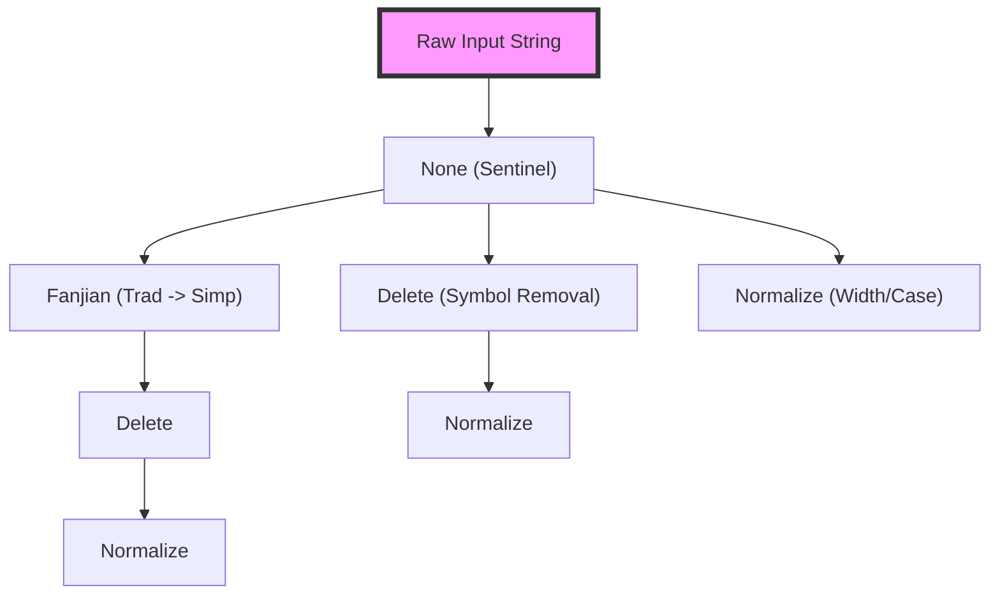
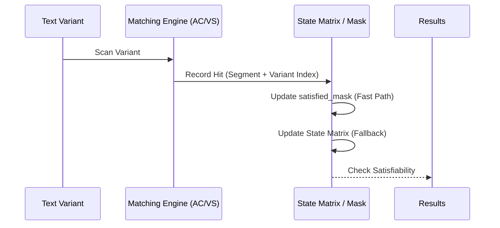

# Design

## Transformation

* `FANJIAN` (used in `Fanjian`): built from [Unihan_Variants.txt](./data/str_conv/Unihan_Variants.txt) and [EquivalentUnifiedIdeograph.txt](./data/str_conv/EquivalentUnifiedIdeograph.txt).
* `NUM-NORM` (used in `Normalize`): built from [DerivedNumericValues.txt](./data/str_conv/DerivedNumericValues.txt).
* `TEXT-DELETE` (used in `Delete`): built from [DerivedGeneralCategory.txt](./data/str_conv/DerivedGeneralCategory.txt) (contains symbols and punctuation characters for removal).
* `WHITE-SPACE` (used in `Delete`): a hardcoded list of Unicode whitespace characters.
* `PINYIN` and `PINYIN-CHAR` (used in `PinYin` and `PinYinChar`): built from [Unihan_Readings.txt](./data/str_conv/Unihan_Readings.txt).
* `NORM` (used in `Normalize`): built from [NormalizationTest.txt](./data/str_conv/NormalizationTest.txt) and [DerivedGeneralCategory.txt](./data/str_conv/DerivedGeneralCategory.txt) (contains alphanumeric and general symbol variations).

## SimpleMatcher

### Overview

The `SimpleMatcher` is the core component, designed to be fast, efficient, and easy to use. It handles large amounts of data and identifies words based on predefined types. It supports complex logical operations within a single pattern entry:
- **AND (`&`)**: All sub-patterns separated by `&` must match for the rule to trigger.
- **NOT (`~`)**: If any sub-pattern preceded by `~` matches, the rule is disqualified.

### Key Concepts

1. **WordID**: Represents a unique identifier for a word in the `SimpleMatcher`.

### Structure

The `SimpleMatcher` uses a mapping structure to define words and their IDs based on different match types. Below is an example configuration:

```json
{
    "1": {
        "1": "hello&world",
        "2": "你好"
        // other words
    }
    // other simple match type word maps
}
```

- `1` and `2`: These are `WordID`s used to identify words in the `SimpleMatcher`.

### Real-world Application

In real-world scenarios, `word_id` is used to uniquely identify a word in the database, allowing for easy updates to the word and its variants.

### Logical Operations

- **OR Logic (between different `process_type` and words in the same `process_type`)**: The `simple_matcher` is considered matched if any word in the map is matched.
- **AND Logic (between words separated by `&` within a `WordID`)**: All words separated by `&` must be matched for the word to be considered as matched.
- **NOT Logic (between words separated by `~` within a `WordID`)**: All words separated by `~` must not be matched for the word to be considered as matched.

### Usage Cases

#### Word1 AND Word2 match
```json
Input:
{
    "1": {
        "1": "word1&word2"
    }
}

Output: Check if `word_id` 1 is matched.
```

#### Word1 OR Word2 match
```json
Input:
{
    "1": {
        "1": "word1",
        "2": "word2"
    }
}

Output: Check if `word_id` 1 or 2 is matched.
```

#### Word1 NOT Word2 match
```json
Input:
{
    "1": {
        "1": "word1~word2"
    }
}

Output: Check if `word_id` 1 is matched.
```

## Architecture & Optimization

To achieve extremely high throughput and robust latency across thousands of simultaneous matching rules, `matcher_rs` incorporates several advanced architectural optimizations beneath its logical API.

### 1. Text Transformation Pipeline (DAG-based Reduction)

Real-world text matching often requires matching across multiple variations (Traditional/Simplified Chinese, symbol removal, Pinyin, etc.). Naively applying these transformations sequentially would lead to exponential work and redundant string allocations.

#### `ProcessType` Tree Optimization
`matcher_rs` constructs a Directed Acyclic Graph (DAG) of transformations via `build_process_type_tree`. This tree represents all unique paths of processing required by the user's rule set.



*   **Breadth-First Traversal**: The transformation pipeline traverses this DAG level-by-level.
*   **Shared Prefixes**: If two rules require `Fanjian | Delete` and `Fanjian | Normalize`, the `Fanjian` step is performed only once, and its output is shared.
*   **Thread-Local State**: Traversal uses a `REDUCE_STATE` thread-local buffer to track node indices, eliminating heap allocations for traversal metadata.
*   **Bitmask Aggregation**: As variants are generated, they are tagged with a `u64` bitmask representing all `ProcessType` combinations that lead to that specific string variant.

### 2. High-Performance Matching Engine

The matching process is divided into two distinct phases to decouple substring search from complex logical evaluation.

#### Pass 1: Pattern Scanning
All unique sub-patterns (segments separated by `&` or `~`) are deduplicated and compiled into a single high-performance automaton:
*   **Aho-Corasick**: Uses `ContiguousNFA` or `DFA` depending on feature flags for $O(N)$ scanning.
*   **Vectorscan (Hyperscan)**: Optional SIMD-accelerated engine for ultra-fast literal matching on supported architectures.

For every hit, the engine updates a thread-local `SimpleMatchState` identifying which logical segments of which rules were satisfied in which text variant.

#### Pass 2: Logical Evaluation
The system evaluates the accumulated state to determine if any rules are fully satisfied.



### 3. Logical Evaluation Optimizations

#### Bitmask Fast-Path
Most matching rules consist of simple AND/NOT conditions where each part only needs to appear once. `matcher_rs` optimizes these via bitmasks:
*   **`satisfied_mask`**: A `u64` where each bit represents a satisfied logical segment.
*   **`expected_mask`**: A pre-calculated mask of required bits.
*   **$O(1)$ Evaluation**: Verification becomes a simple integer comparison (`mask == expected`).

#### Matrix Skip (`use_matrix`)
For rules that don't require count-based logic (e.g., "match 'a' at least twice") or have fewer than 64 splits, the engine sets a `use_matrix: false` flag. This bypasses the initialization and maintenance of the `i32` state matrix, significantly reducing memory bandwidth and CPU cycles.

#### Fallback Engine
For complex requirements (e.g., more than 64 logical segments or count-based AND logic like `a&a&b`), the system transparently falls back to a robust `i32` matrix-based counter system.

### 4. Memory & State Management

*   **Generation-based State Re-use**: `SimpleMatchState` uses a "generation ID" system. Instead of clearing large vectors between calls, it increments a counter. Entries are only re-initialized if their generation ID is stale, effectively providing a zero-cost "clear" operation.
*   **String Pooling**: A thread-local `STRING_POOL` caches and reuses `String` allocations produced during transformations, mitigating pressure on the global allocator.
*   **Zero-Copy Logic (`Cow<'a, str>`)**: Transformations are lazy. If no changes are needed (e.g., `Delete` on a string with no symbols), the system returns a borrowed reference, avoiding all copying.
*   **Multithreaded Safety**: All mutable state is stored in `thread_local!` buffers, ensuring that `SimpleMatcher` is `Send + Sync` and can be safely shared via `Arc` across high-concurrency environments without lock contention.

### 5. Static vs. Dynamic Automata

*   **Zero-Cost Construction (Static)**: Core transformation rules (Fanjian, Pinyin) are pre-compiled into optimized byte-layouts at library compile-time. At runtime, these are "loaded" via `unsafe` zero-copy pointer casts, resulting in **instant startup**.
*   **Efficient Construction (Dynamic)**: User-provided rules are compiled into optimized Aho-Corasick or Vectorscan structures. The builder employs a "Minimum Word Set" strategy, emitting only canonical forms to keep the final automaton as compact as possible.
