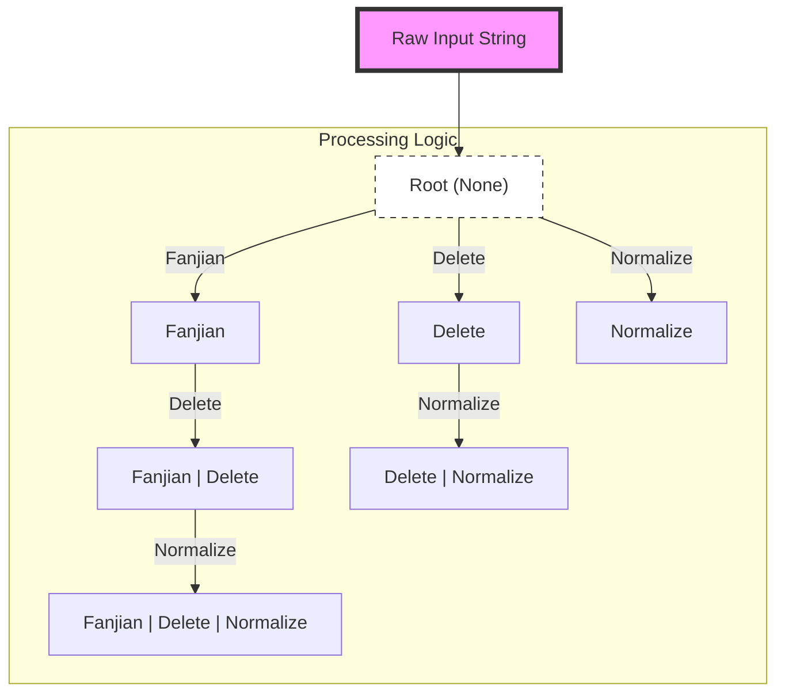
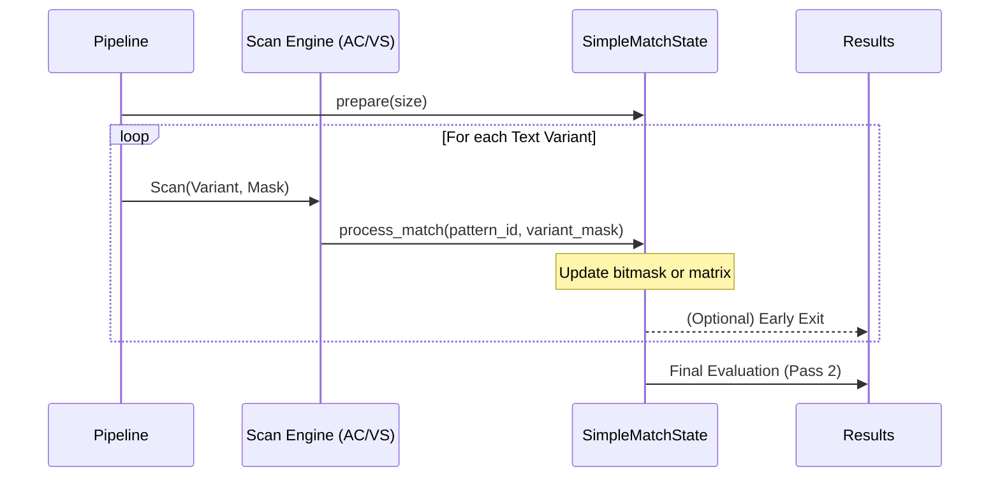

# Design

## Transformation

* `FANJIAN` (used in `Fanjian`): built from [Unihan_Variants.txt](./data/str_conv/Unihan_Variants.txt) and [EquivalentUnifiedIdeograph.txt](./data/str_conv/EquivalentUnifiedIdeograph.txt).
* `NUM-NORM` (used in `Normalize`): built from [DerivedNumericValues.txt](./data/str_conv/DerivedNumericValues.txt).
* `TEXT-DELETE` (used in `Delete`): built from [DerivedGeneralCategory.txt](./data/str_conv/DerivedGeneralCategory.txt) (contains symbols and punctuation characters for removal).
* `WHITE-SPACE` (used in `Delete`): a hardcoded list of 27 Unicode whitespace codepoints.
* `PINYIN` and `PINYIN-CHAR` (used in `PinYin` and `PinYinChar`): built from [Unihan_Readings.txt](./data/str_conv/Unihan_Readings.txt).
* `NORM` (used in `Normalize`): built from [NormalizationTest.txt](./data/str_conv/NormalizationTest.txt) and [DerivedGeneralCategory.txt](./data/str_conv/DerivedGeneralCategory.txt) (contains alphanumeric and general symbol variations).

## SimpleMatcher

### Overview

The `SimpleMatcher` is the core component, designed to be fast, efficient, and easy to use. It handles large amounts of data and identifies words based on predefined types. It supports complex logical operations within a single pattern entry:
- **AND (`&`)**: All sub-patterns separated by `&` must match for the rule to trigger.
- **NOT (`~`)**: If any sub-pattern preceded by `~` matches, the rule is disqualified.

### Key Concepts

1. **WordID**: Represents a unique identifier for a word in the `SimpleMatcher`.

### Structure

The `SimpleMatcher` uses a mapping structure to define words and their IDs based on different match types. Below is an example configuration:

```json
{
    "1": {
        "1": "hello&world",
        "2": "你好"
    }
}
```

The outer key is the `ProcessType` as a serialized `u8`. The inner keys (`1`, `2`) are `WordID`s.

### Real-world Application

In real-world scenarios, `word_id` is used to uniquely identify a word in the database, allowing for easy updates to the word and its variants.

### Logical Operations

- **OR Logic (between different `process_type` and words in the same `process_type`)**: The `simple_matcher` is considered matched if any word in the map is matched.
- **AND Logic (between words separated by `&` within a `WordID`)**: All words separated by `&` must be matched for the word to be considered as matched.
- **NOT Logic (between words separated by `~` within a `WordID`)**: All words separated by `~` must not be matched for the word to be considered as matched.

### Usage Cases

#### Word1 AND Word2 match
```json
Input:
{
    "1": {
        "1": "word1&word2"
    }
}

Output: Check if `word_id` 1 is matched.
```

#### Word1 OR Word2 match
```json
Input:
{
    "1": {
        "1": "word1",
        "2": "word2"
    }
}

Output: Check if `word_id` 1 or 2 is matched.
```

#### Word1 NOT Word2 match
```json
Input:
{
    "1": {
        "1": "word1~word2"
    }
}

Output: Check if `word_id` 1 is matched.
```

## Architecture & Optimization

To achieve extremely high throughput and robust latency across thousands of simultaneous matching rules, `matcher_rs` incorporates several advanced architectural optimizations beneath its logical API.

### 1. Text Transformation Pipeline (DAG-based Reduction)

Real-world text matching often requires matching across multiple variations (Traditional/Simplified Chinese, symbol removal, Pinyin, etc.). Naively applying these transformations sequentially would lead to exponential work and redundant string allocations.

#### `ProcessType` Bitmask & Trie Optimization

`matcher_rs` uses an 8-bit `ProcessType` bitmask to represent combinations of transformations. At initialization, it constructs a Directed Acyclic Graph (DAG) in the form of a Trie via `build_process_type_tree`. Each node in this tree (`ProcessTypeBitNode`) represents a unique single-bit transformation step (`Fanjian`, `Delete`, `Normalize`, `PinYin`, etc.) and holds the list of composite `ProcessType`s that pass through it.



*   **Breadth-First Traversal**: `reduce_text_process_with_tree` traverses this DAG. For each node, it applies its specific transformation to the output of its parent node.
*   **Shared Prefixes**: If multiple rules require transformation chains that share a prefix (e.g., `Fanjian | Delete` and `Fanjian | Normalize`), the `Fanjian` step is performed only once and its result reused.
*   **Lazy Transformations (`Cow<'a, str>`)**: If a transformation step finds no characters to modify, it returns `Cow::Borrowed` — no allocation occurs. Only actual changes produce `Cow::Owned`.
*   **Bitmask Aggregation**: Each generated text variant is tagged with a `u64` bitmask representing all `ProcessType` combinations that produced that variant. A single scan satisfies multiple rule configurations simultaneously.
*   **Traversal Scratch Buffer**: A thread-local `REDUCE_STATE: RefCell<Vec<usize>>` holds the mapping from node index to processed-text index, avoiding per-call allocation.

#### Transformation Backends

Each `ProcessType` bit is backed by a data structure optimized for its access pattern:

| `ProcessType` | Backend | Complexity |
|---|---|---|
| `Fanjian` | 2-stage page table (L1: 4352 × u16, L2: dense u32 blocks) | O(1) per codepoint |
| `PinYin` / `PinYinChar` | 2-stage page table mapping codepoint → packed `(offset << 8 \| length)` into a concatenated UTF-8 string buffer | O(1) per codepoint |
| `Delete` | 139 KB flat BitSet covering all Unicode codepoints | O(1) per codepoint, branchless |
| `Normalize` | `daachorse` `CharwiseDoubleArrayAhoCorasick<u32>` (leftmost-longest) or Aho-Corasick DFA | O(N) per text |

### 2. High-Performance Matching Engine (Two-Pass)

The matching process is divided into two distinct phases to decouple substring search from complex logical evaluation.

#### Pass 1: Pattern Scanning (Deduplicated)

All unique sub-patterns (segments separated by `&` or `~`) from all rules and all `ProcessType` variants are deduplicated and compiled into a single automaton. Each automaton pattern maps back to one or more rule segments via two parallel arrays:

*   `ac_dedup_ranges: Vec<(usize, usize)>` — `(start, length)` slice of `ac_dedup_entries` for each pattern index.
*   `ac_dedup_entries: Vec<WordConfEntry>` — each entry holds `(process_type_mask, word_conf_idx, offset)` identifying which rule segment this pattern hit satisfies.

Three backend options are supported:

*   **`ContiguousNFA`** (default, `!dfa`): Compact, memory-efficient NFA. Overlapping search.
*   **`DFA`** (`dfa` feature): ~10× more memory, faster throughput. Overlapping search.
*   **Vectorscan** (`vectorscan` feature): SIMD-accelerated via Intel Hyperscan. Requires Boost. No Windows/ARM64.

#### Pass 2: Logical Evaluation



### 3. State Management & Evaluation Optimizations

#### Per-Rule State: `WordConf` and `WordState`

Each compiled rule produces a `WordConf`:
*   `split_bit: Vec<i32>` — one counter per segment: positive for AND (`&`), negative for NOT (`~`). Count reflects how many times that sub-pattern must match.
*   `not_offset: usize` — index separating AND segments from NOT segments in `split_bit`.
*   `expected_mask: u64` — precomputed bitmask where each bit represents one AND segment (valid only when `use_matrix = false`).
*   `use_matrix: bool` — `true` if the rule has >64 segments or any segment count >1.

Per-query mutable state per rule is stored in `WordState` (12 bytes):
*   `satisfied_mask: u64` — accumulates which AND segments have been hit.
*   `matrix_generation: u32` — generation ID for lazy initialization of matrix rows.
*   `not_generation: u32` — set to the current generation if any NOT segment fires, permanently disqualifying the rule for this query.

#### Generation-based State Re-use

`SimpleMatchState` avoids clearing state between queries using a **monotonic generation counter** (`generation: u32`):
*   An entry is "empty" if its generation ID doesn't match the current one — an O(1) check.
*   On `u32::MAX` overflow, all generation IDs are explicitly reset to avoid stale matches.

#### Sparse-Set: `touched_indices`

`SimpleMatchState.touched_indices: Vec<usize>` records which rules were touched during Pass 1. Pass 2 only evaluates those entries, not the full `word_conf_list`. This keeps evaluation cost proportional to the number of rule hits, not total rule count.

#### Bitmask Fast-Path

Rules with ≤64 AND segments where every segment appears exactly once skip matrix allocation:
*   **O(1) verification**: `satisfied_mask == expected_mask`.
*   **NOT short-circuit**: the first NOT hit sets `not_generation = generation`, immediately disqualifying the rule for all subsequent pattern hits in the same query.

#### Matrix-based Fallback

Rules with >64 segments or repeated AND segments use a flat `Vec<TinyVec<[i32; 16]>>` matrix:
*   Rows represent logical segments; columns represent text variants.
*   Each cell is initialized from `split_bit[segment]` (positive for AND, negative for NOT).
*   A hit decrements the cell. A segment is satisfied when its value ≤ 0 in any column.
*   For NOT segments, a hit increments the cell. A NOT fires when the value > 0.

### 4. Memory & Resource Efficiency

*   **String Pooling**: A thread-local `STRING_POOL: RefCell<Vec<String>>` (capped at 128 entries) caches and reuses `String` allocations produced during transformations, reducing pressure on the global allocator.
*   **Zero-Copy Logic**: Heavy use of `Cow<'a, str>` during transformation and zero-copy deserialization (`include_bytes!`) for static transformation tables ensures minimal memory overhead.
*   **Static Automata**: Core transformation tables (Fanjian, Pinyin, Delete, Normalize) are pre-compiled into binary artifacts at library compile-time via `build.rs`. At runtime, they are loaded via zero-copy byte-slice casts for **instant startup**.
*   **Thread-Local Storage (TLS)**: All mutable matching state (`SimpleMatchState`, `STRING_POOL`, `REDUCE_STATE`, Vectorscan scratch) is stored in `thread_local!` buffers. `SimpleMatcher` itself is `Send + Sync` and can be shared across threads via `Arc` with zero lock contention.
*   **MiMalloc v3**: The global allocator is replaced with `mimalloc` for improved multi-threaded allocation performance.

### 5. Feature Flags

| Flag | Default | Effect |
|------|---------|--------|
| `dfa` | on | Aho-Corasick DFA backend — faster scan, ~10× memory vs `ContiguousNFA` |
| `vectorscan` | off | SIMD matching via Intel Hyperscan — requires Boost; unsupported on Windows/ARM64 |
| `runtime_build` | off | Build transformation tables at runtime from source text files — slower init, enables dynamic rules |

### 6. Compiled vs. Runtime Transformation Tables

**Static (default):** `build.rs` pre-compiles all transformation tables into binary artifacts embedded in the library via `include_bytes!`. Zero startup cost.

**Runtime (`runtime_build` feature):** Tables are built from the raw source text files at process startup. Slower initialization but allows custom or updated transformation data without recompiling the library.
