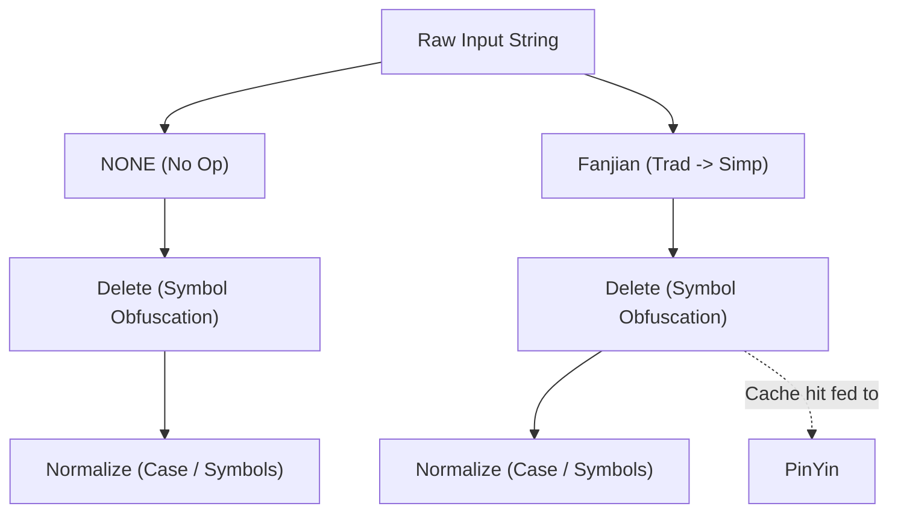

# Design

## Transformation

* `FANJIAN`: build from [Unihan_Variants.txt](./data/str_conv/Unihan_Variants.txt) and [EquivalentUnifiedIdeograph.txt](./data/str_conv/EquivalentUnifiedIdeograph.txt).
* `NUM-NORM`: build from [DerivedNumericValues.txt](./data/str_conv/DerivedNumericValues.txt).
* `TEXT-DELETE` and `SYMBOL-NORM`: build from [DerivedGeneralCategory.txt](./data/str_conv/DerivedGeneralCategory.txt).
* `WHITE-SPACE`: build from [PropList.txt](./data/str_conv/PropList.txt).
* `PINYIN` and `PINYIN-CHAR`: build from [Unihan_Readings.txt](./data/str_conv/Unihan_Readings.txt).
* `NORM`: build from [NormalizationTest.txt](./data/str_conv/NormalizationTest.txt).

## SimpleMatcher

### Overview

The `SimpleMatcher` is the core component, designed to be fast, efficient, and easy to use. It handles large amounts of data and identifies words based on predefined types. It supports complex logical operations within a single pattern entry:
- **AND (`&`)**: All sub-patterns separated by `&` must match for the rule to trigger.
- **NOT (`~`)**: If any sub-pattern preceded by `~` matches, the rule is disqualified.

### Key Concepts

1. **WordID**: Represents a unique identifier for a word in the `SimpleMatcher`.

### Structure

The `SimpleMatcher` uses a mapping structure to define words and their IDs based on different match types. Below is an example configuration:

```json
{
    "1": {
        "1": "hello&world",
        "2": "你好"
        // other words
    }
    // other simple match type word maps
}
```

- `1` and `2`: These are `WordID`s used to identify words in the `SimpleMatcher`.

### Real-world Application

In real-world scenarios, `word_id` is used to uniquely identify a word in the database, allowing for easy updates to the word and its variants.

### Logical Operations

- **OR Logic (between different `process_type` and words in the same `process_type`)**: The `simple_matcher` is considered matched if any word in the map is matched.
- **AND Logic (between words separated by `&` within a `WordID`)**: All words separated by `&` must be matched for the word to be considered as matched.
- **NOT Logic (between words separated by `~` within a `WordID`)**: All words separated by `~` must not be matched for the word to be considered as matched.

### Usage Cases

#### Word1 AND Word2 match
```json
Input:
{
    "1": {
        "1": "word1&word2"
    }
}

Output: Check if `word_id` 1 is matched.
```

#### Word1 OR Word2 match
```json
Input:
{
    "1": {
        "1": "word1",
        "2": "word2"
    }
}

Output: Check if `word_id` 1 or 2 is matched.
```

#### Word1 NOT Word2 match
```json
Input:
{
    "1": {
        "1": "word1~word2"
    }
}

Output: Check if `word_id` 1 is matched.
```

## Architecture & Optimization

To achieve extremely high throughput and robust latency across thousands of simultaneous matching rules, `matcher_rs` incorporates several advanced architectural optimizations beneath its logical API.

### Minimum Word Set Optimization
The `SimpleMatcher` employs a "Minimum Word Set" strategy during construction to minimize the size and memory footprint of the underlying Aho-Corasick automaton:

1.  **Canonical Pattern Emitting**: When building the matcher, `reduce_text_process_emit` transforms user patterns into their canonical forms for a given `ProcessType`. For N-to-1 transformations like `Fanjian` (Simplified Chinese), only the final simplified form is emitted. This is sufficient because the input text pipeline also simplifies the text, ensuring a match against a single optimized entry in the automaton.
2.  **Delete-Subtractive Matching**: The `Delete` transformation is explicitly subtracted from pattern processing. This keeps patterns "clean" (no internal noise or whitespace). Since the input pipeline removes noise characters from target text, a single clean pattern in the AC matcher can match an infinite variety of "noisy" inputs.
3.  **Automaton Minimization**: By avoiding storage of redundant intermediate or noisy pattern variants, the Aho-Corasick automaton remains as small as possible, improving cache locality and matching throughput.

### `ProcessType` Tree Optimization
Words and sentences in the real world involve complex combinations of variations, such as Simplified vs. Traditional Chinese (`Fanjian`), symbol obfuscation (`Delete`), and casing (`Normalize`). These variations are handled by flags called `ProcessType`s.

To prevent redundant processing of the same string, `matcher_rs` constructs a graph (the `ProcessType` tree) via `build_process_type_tree`.



1. When a string enters the system, it explores nodes sequentially.
2. The tree ensures the `Delete` transformation is performed exactly once.
3. The cached output of the `Delete` branch is then fed directly as the starting state into the `PinYin` branch.
4. Intermediate states are collected in `ProcessedTextMasks` avoiding overlapping operations.

### Aho-Corasick Automata Construction
`matcher_rs` utilizes two fundamentally different compilation strategies for Aho-Corasick automata to maximize performance based on the lifetime of the data.

1. **Static Pre-compiled Automata (Zero-Cost Construction):**
   The internal string transformation rules (like mapping Traditional to Simplified characters, or parsing `PinYin` readings from Unicode variants) are known at library compile-time. `matcher_rs` statically compiles these patterns into optimized byte-layouts via `CharwiseDoubleArrayAhoCorasick` and exports them directly into the compiled binary as `&[u8]` arrays. At runtime, fetching a configuration via `get_process_matcher` involves a `deserialize_unchecked` cast, requiring exactly **zero memory allocation and zero initialization time**.

2. **Dynamically Constructed User Automata:**
   The `SimpleMatcher` receives an arbitrary pool of search terms at runtime. It dynamically constructs a `CharwiseDoubleArrayAhoCorasick` or `AhoCorasick` (or `Vectorscan` if enabled) automaton. This automaton maps input substrings directly to internal `word_id` mappings, ensuring that searching a text for 10 words or 10,000 words operates with roughly `O(N)` bounds over the length of the string, uncoupled from the size of the search dictionary.

### Memory Layout and Performance Limitations

* **Zero-Copy Parsers (`Cow<'a, str>`):**
  String transformations (`Delete`, `Normalize`) operate lazily. If a string undergoes a `Normalize` transformation but the string contains no combinable characters or varied casings, the system returns a `Cow::Borrowed` pointer to the original memory address, omitting the internal allocation of a `String` entirely.
* **Global Memory Allocators (FFI Boundaries):**
  The highly-concurrent matching algorithms require a robust multithreaded allocator capable of preventing memory fragmentation. `matcher_rs` uses `mimalloc` to guarantee max throughput in multi-threaded runtime environments.
